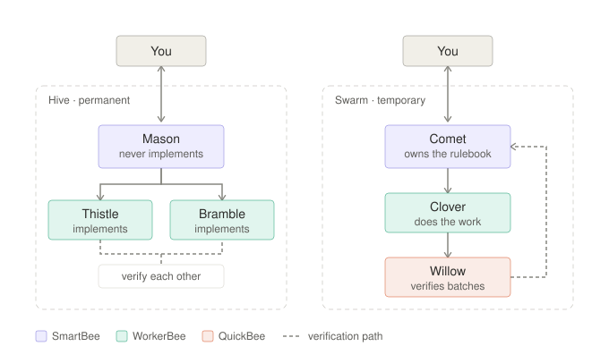

# buzz-agent-teams

Two ready-to-import agent teams for [Buzz](https://github.com/block/buzz) — a standing **Hive**
and a disposable **Swarm** — plus a benchmark task for comparing them.

Built following Block's [Effective teams of agents](https://engineering.block.xyz/blog/effective-teams-buzz),
with the prompts written against Block's own reference personas in
[`benchmarks/harbor-buzz-orchestra`](https://github.com/block/buzz/tree/main/benchmarks/harbor-buzz-orchestra).

<picture>
  <source media="(prefers-color-scheme: dark)" srcset="diagrams/hive-vs-swarm.dark.svg">
  
</picture>

The structural difference is the dashed **verification path**. The Hive has two peers who check
each other. The Swarm is an assembly line with a dedicated verifier whose verdict loops back to
the coordinator, who folds it into the rulebook before assigning the next batch.

## What's here

```
teams/hive.team.json      importable team snapshot — Mason, Thistle, Bramble
teams/swarm.team.json     importable team snapshot — Comet, Clover, Willow
scripts/apply-tiers.sh    sets per-agent ANTHROPIC_MODEL + CLAUDE_CODE_EFFORT_LEVEL
diagrams/build.py         regenerates both SVG variants from one geometry definition
benchmark/generate.sh     builds a self-contained migration task to test a team on
benchmark/BRIEF.md        the task brief handed to the team
```

## Which team for which work

The test: **can you enumerate the work before starting?**

| | **Hive** | **Swarm** |
|---|---|---|
| Lifespan | Permanent | Ends when the work list is empty |
| Memory is about | **You** — your preferences, your prior decisions | **The project** — an edge-case rulebook |
| Work arrives | One varied request at a time | As a list you can write down up front |
| Scales by | Not really — fixed at three | Cloning workers once the pattern holds |
| Good for | Features, bugs, review, "why is X slow" | Upgrades, migrations, codemods, coverage sweeps |

Below both: a task that finishes in minutes should go to a **single agent**. The article is
explicit that teams lose to solos on short work — *"small tasks that finish in minutes don't have
enough structure to divide."* The +33% figure is for long-horizon work only.

### Hive

| Agent | Tier | Model | Job |
|---|---|---|---|
| Mason | SmartBee | Opus 5 | Coordinates. Decides, assigns, reviews. **Does not implement.** |
| Thistle | WorkerBee | Sonnet 5 | Implements subtasks end to end. |
| Bramble | WorkerBee | Sonnet 5 | Second lane — and verifies Thistle, and vice versa. |

One SmartBee + two WorkerBees is the exact shape the article benchmarked. There's no dedicated
verifier; Mason routes each WorkerBee's output to the other, so nobody reviews their own work.

### Swarm

| Agent | Tier | Model | Job |
|---|---|---|---|
| Comet | SmartBee | Opus 5 | Owns the work list and the edge-case **rulebook**. **Does not migrate.** |
| Clover | WorkerBee | Sonnet 5 | Applies the established pattern, batch by batch. |
| Willow | QuickBee | Haiku 4.5 | Verifies every batch. Pass or fail, no maybe. |

The rulebook is the point: every resolved edge case is written to Comet's memory and stated
in-channel, so escalation volume trends *down* as the project runs. Starting with one worker is
deliberate — extra workers before the pattern is established just multiply the same mistake.
Clover carries a `namePool` for cloning.

## The protocol

Both teams run the rules from Block's reference orchestrator and worker personas:

- **Coordinators do not do the work.** They read to decide, then assign.
- **One step per message, one agent, explicit `@mention`.** An agent only wakes for messages that
  mention it by name — a message that mentions nobody reaches nobody and the work stalls.
- **The coordinator assigns file ownership.** Agents share a filesystem; they are never left to
  negotiate collisions themselves.
- **Wait for a report before assigning anything that depends on it.**
- **Independent verification, never self-review.**
- **Do the work before reporting it.** Never describe output you haven't produced; never claim
  success without showing what proves it.
- **On a blocking failure, report verbatim and stop** rather than improvising a different approach.
- **Finish with a `DONE:` message** that mentions the owner. Never conclude silently.

> **The rule that matters most is the first one.** An earlier version of these prompts told the
> Swarm coordinator to "do one unit of the work yourself first, then write down the pattern."
> That sounds reasonable — you can't rule on edge cases you've never met — but it has no stopping
> condition. The coordinator did the entire migration alone and its two workers were never
> triggered once. The Hive, whose coordinator was told to push work down, delegated correctly on
> the same day. Block's reference persona opens with *"You do not run commands yourself; your
> workers do."* That line is load-bearing.

**One deliberate deviation from the reference:** Block's personas require an explicit
`buzz messages send` every turn because their Harbor harness doesn't auto-publish. Buzz Desktop
does auto-publish an agent's reply, so these prompts keep the mention discipline and drop the CLI
mechanics — including them risks double-posting.

## Install

Buzz Desktop → **Agents → Agent teams → +** → import a `.team.json`.

Import mints a fresh Nostr keypair per agent, computes each NIP-OA `auth_tag` with your owner key,
and writes the agents into `managed-agents.json` plus a team record in `teams.json` under:

```
~/Library/Application Support/xyz.block.buzz.app/agents/     # macOS
```

### Fill in the placeholders first

The snapshots ship with three placeholders. Replace them before importing:

| Placeholder | Replace with |
|---|---|
| `OWNER` | Your display name, as agents should address you |
| `HIVE_CHANNEL_ID` | The channel UUID the Hive lives in |
| `SWARM_CHANNEL_ID` | The channel UUID the Swarm lives in |

Create the two channels first, then grab their UUIDs from `buzz channels list`. If you later
recreate a channel, update the prompts — the UUID is baked into each coordinator's system prompt.

```bash
sed -i '' 's/OWNER/Ada/; s/HIVE_CHANNEL_ID/<uuid>/' teams/hive.team.json
sed -i '' 's/OWNER/Ada/; s/SWARM_CHANNEL_ID/<uuid>/' teams/swarm.team.json
```

### Then apply the model tiers

```bash
./scripts/apply-tiers.sh          # --dry to preview; keeps a timestamped .bak
```

Quit Buzz first. Re-run after cloning a worker — the tier table covers every `namePool` name.

| Tier | `ANTHROPIC_MODEL` | `CLAUDE_CODE_EFFORT_LEVEL` |
|---|---|---|
| SmartBee | `claude-opus-5` | `medium` |
| WorkerBee | `claude-sonnet-5` | `high` |
| QuickBee | `claude-haiku-4-5-20251001` | `xhigh` |

Effort runs *inverse* to model strength, per the article — cheaper models get pushed harder to
compensate.

## Field notes

Things that cost time to work out, in case they save you some.

**You can't create agents by hand-editing `managed-agents.json`.**
[`create_managed_agent`](https://github.com/block/buzz/blob/main/desktop/src-tauri/src/commands/agents.rs)
generates each agent's keypair and stores the nsec in the OS keychain — it is never in the JSON,
and the `auth_tag` is computed with your owner secret. A hand-written record has no signing key
and cannot authenticate to the relay. Import is the only way in.

**Editing an agent that already exists is fine, though.** Prompts live in three records per agent
(two instances and one definition), all keyed by `name` in `managed-agents.json`; team-level
`instructions` live in `teams.json`. Patch them with Buzz **fully quit** — it rewrites both files
on exit and will clobber changes made while running — then restart each agent, since the prompt is
read at spawn, not per turn. Prefer this to re-importing: a re-import mints new keys and the agents
lose accumulated memory.

**`env_vars` is excluded from snapshots by design** — it can carry secrets. That's why the model
tiers are a separate script rather than part of the import. Env precedence at spawn is baked
defaults → runtime metadata → user `env_vars`, last wins; see
[`readiness.rs`](https://github.com/block/buzz/blob/main/desktop/src-tauri/src/managed_agents/readiness.rs).

**Agents wake only on mentions.** Each one starts with `subscribe=Mentions`, and
[`filter.rs`](https://github.com/block/buzz/blob/main/crates/buzz-acp/src/filter.rs) requires a
`p` tag matching the agent's pubkey. A bare `@Name` in prose does resolve — as long as the name is
unique among channel members. Duplicate agent names are worth cleaning up for that reason.

**`respondTo` must not be `owner-only`.** Every member here ships as `anyone`, because the whole
design is agents mentioning each other and `owner-only` means an agent ignores everything not from
you — a worker could never reach its coordinator. `anyone` means any member of your relay can
trigger these agents; if that relay gains members you don't want driving the teams, switch to
`allowlist` in the UI and add the teammates' pubkeys. Allowlists can't be preset in a snapshot —
pubkeys don't exist until import, and Buzz drops source-environment allowlists deliberately.

**Persona packs are not team snapshots.** The
[persona pack spec](https://github.com/block/buzz/blob/main/crates/buzz-persona/PERSONA_PACK_SPEC.md)
describes a portable, git-friendly `.buzzpack` format — but the desktop app's Import accepts only
`.agent.json` / `.team.json` snapshots, and rejects packs outright. The two formats don't convert.

## Checking that delegation actually happened

The failure mode to watch for is a coordinator quietly doing everything alone. Agent logs make it
obvious — a worker that was never triggered has zero sessions:

```bash
A="$HOME/Library/Application Support/xyz.block.buzz.app/agents"; jq -r '.[]|select(.pubkey!="")|"\(.pubkey[0:8]) \(.name)"' "$A/managed-agents.json" | sort > /tmp/names.txt; for f in "$A"/logs/*.log; do b=$(basename "$f"); echo "${b:0:8} $(grep -o 'session_id":"[0-9a-f-]*' "$f" | sort -u | wc -l | tr -d ' ')"; done | sort | join - /tmp/names.txt | awk '{printf "%-10s %s sessions\n", $3, $2}'
```

## Benchmark

A self-contained task for comparing the two teams, or for checking that a team delegates at all.

```bash
./benchmark/generate.sh ~/bench-hive
./benchmark/generate.sh ~/bench-swarm
```

Two byte-identical Node projects (zero dependencies, `node --test`), each a small library whose
database driver is dropping its deprecated callback API. 16 tests pass; a migration gate fails
until the last legacy call site is gone. Point each team at its own checkout and hand it
`BRIEF.md`.

**It is deliberately not a find-and-replace.** A mechanical replace fails 13 of 17 tests. The traps:

| Trap | Punishes |
|---|---|
| Arity-1 callback means errors are swallowed | Assuming the two APIs are equivalent |
| A sync function that must keep returning synchronously | Reflexively making the caller `async` |
| An omitted params argument | The new API rejects without an explicit array |
| Nested dependent callbacks | Getting sequencing wrong |
| A legacy call inside a string literal | Regex-based edits — a test asserts it survives verbatim |
| A vendored file that legitimately uses the old API | Migrating things you shouldn't touch |
| A dead module imported by nothing | — it's one of two open questions the tests don't answer |

A correct migration reaches 17/17. `npm run score` prints tests passed, remaining call sites,
whether vendor was touched, and diff size.

## References

**The idea**
- [Effective teams of agents](https://engineering.block.xyz/blog/effective-teams-buzz) — Hives, Swarms, the QuickBee/WorkerBee/SmartBee tiers
- [block/buzz](https://github.com/block/buzz) — the workspace itself
- [VISION_AGENT.md](https://github.com/block/buzz/blob/main/VISION_AGENT.md) — how Buzz thinks about agents as members

**The prompts these follow**
- [`orchestrator-tb.md`](https://github.com/block/buzz/blob/main/benchmarks/harbor-buzz-orchestra/personas/orchestrator-tb.md) — Block's reference coordinator
- [`worker-tb.md`](https://github.com/block/buzz/blob/main/benchmarks/harbor-buzz-orchestra/personas/worker-tb.md) — Block's reference worker
- [harbor-buzz-orchestra](https://github.com/block/buzz/tree/main/benchmarks/harbor-buzz-orchestra) — the benchmark harness they run

**Formats**
- [`agent_snapshot.rs`](https://github.com/block/buzz/blob/main/desktop/src-tauri/src/managed_agents/agent_snapshot.rs) — `.agent.json` / `.agent.png` schema and its secret exclusions
- [`team_snapshot.rs`](https://github.com/block/buzz/blob/main/desktop/src-tauri/src/managed_agents/team_snapshot.rs) — the `buzz-team-snapshot v1` wrapper
- [PERSONA_PACK_SPEC.md](https://github.com/block/buzz/blob/main/crates/buzz-persona/PERSONA_PACK_SPEC.md) — the portable pack format (not interchangeable with snapshots)
- [Open Plugin Spec](https://open-plugin-spec.org) — packs are a superset

**Runtime behaviour**
- [`filter.rs`](https://github.com/block/buzz/blob/main/crates/buzz-acp/src/filter.rs) — subscription rules and mention dispatch
- [`readiness.rs`](https://github.com/block/buzz/blob/main/desktop/src-tauri/src/managed_agents/readiness.rs) — env precedence at spawn
- [`discovery.rs`](https://github.com/block/buzz/blob/main/desktop/src-tauri/src/managed_agents/discovery.rs) — the runtime catalog (claude, codex, goose, cursor, …)
- [`agents.rs`](https://github.com/block/buzz/blob/main/desktop/src-tauri/src/commands/agents.rs) — agent creation, keypairs, NIP-OA auth tags

## License

MIT — see [LICENSE](LICENSE).
